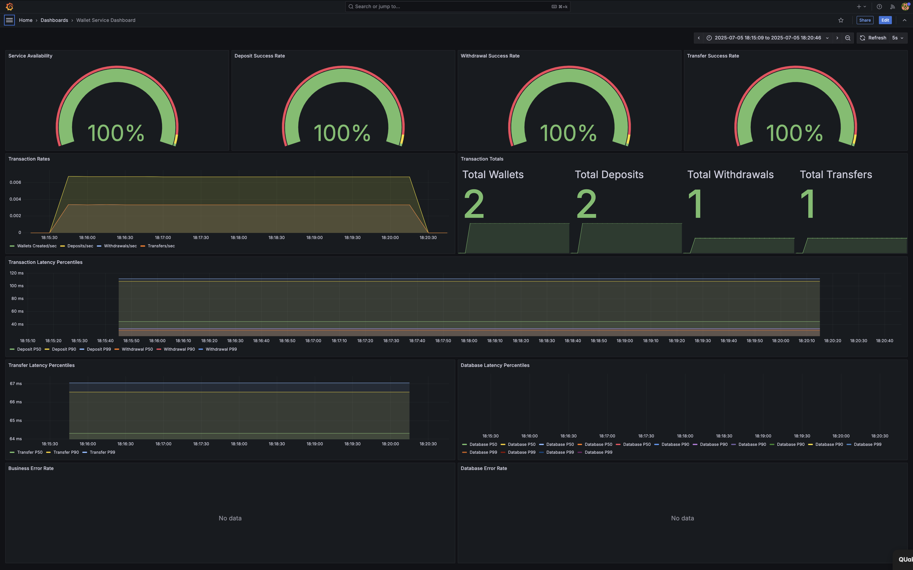
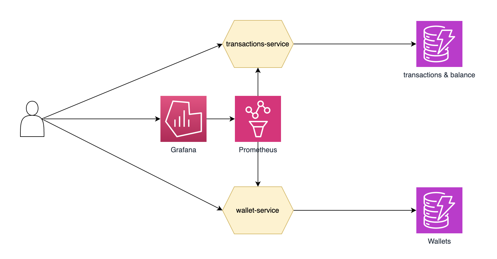
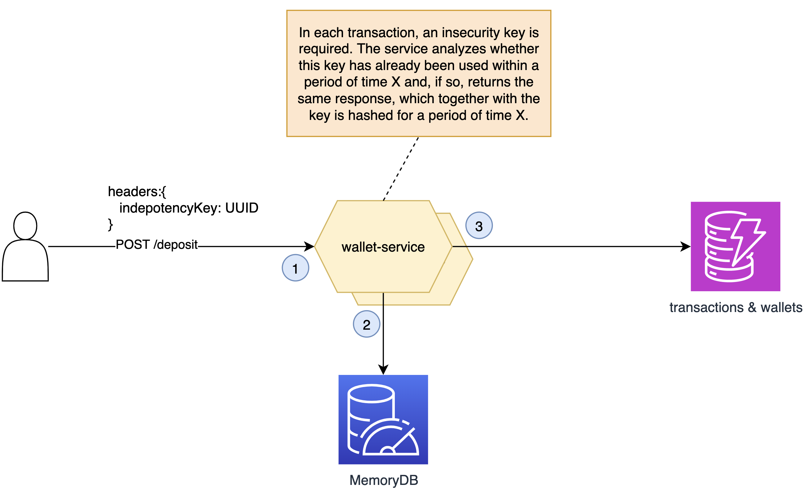
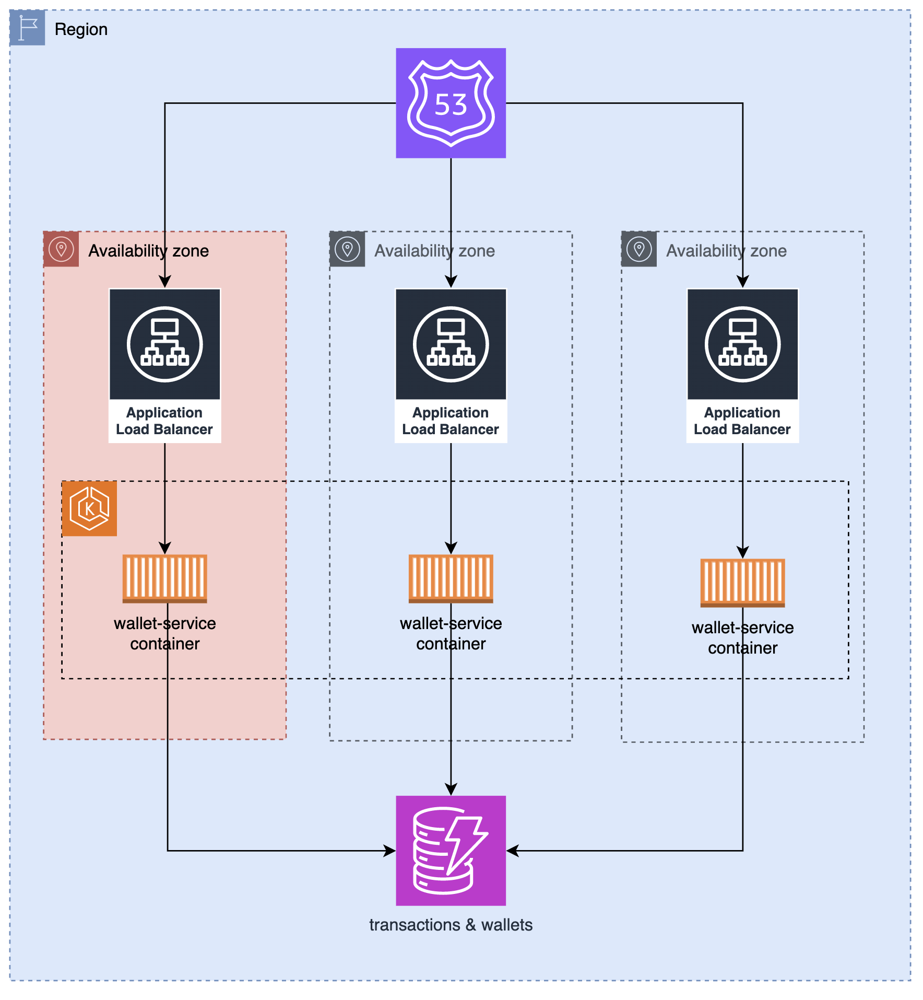
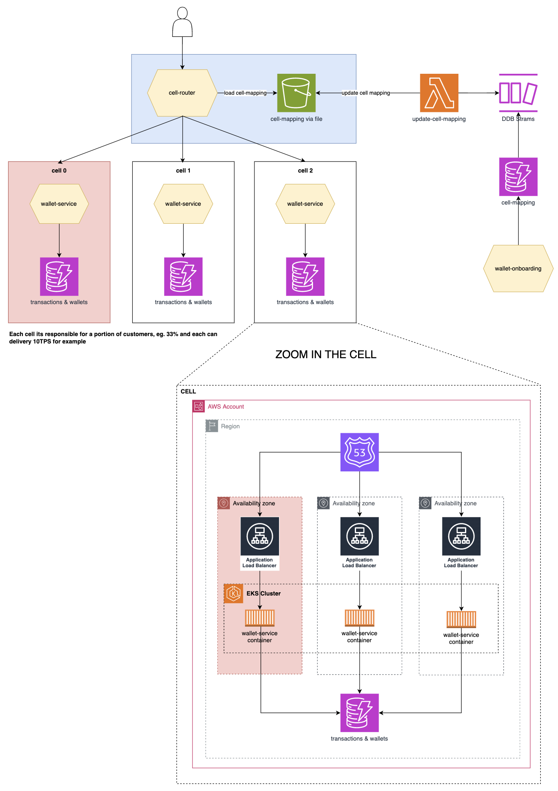

# Wallet Service — Design & Architecture

## 1. Context & Requirements

This service was designed to provide a robust, auditable, and scalable digital wallet for financial operations (deposits, withdrawals, transfers) between users. The requirements and constraints were:

### Assignment Objectives
- Professional, production-grade implementation
- Java with REST API
- Documentation of design choices, trade-offs, and assumptions

### Functional Requirements
- Create Wallet: Allow the creation of wallets for users (one per user)
- Retrieve Balance: Retrieve the current balance of a user's wallet
- Retrieve Historical Balance: Retrieve the balance of a user's wallet at a specific point in the past
- Deposit Funds: Enable users to deposit money into their wallets (DynamoDB Transactions)
- Withdraw Funds: Enable users to withdraw money from their wallets (DynamoDB Transactions)
- Transfer Funds: Facilitate the transfer of money between user wallets (DynamoDB Transactions)

### Non-Functional Requirements
- Mission-critical: Any downtime severely impacts the platform
- Full traceability and auditability of all operations
- High consistency and integrity for monetary operations

## 2. Architecture choices Overview

Given the business needs of the service, I chose the following stack, in addition to Java as specified for the project:

- **Hexagonal Architecture (Ports & Adapters):** Clear separation between domain, application, and infrastructure.
- **Domain-Driven Design (DDD):** Business rules and invariants are enforced in the domain layer.
- **Spring Boot:** For rapid development, dependency injection, and REST API exposure. Since Java is the language and time is short for development, Spring allows for much faster development.
- **DynamoDB:** Since the service is write-intensive and must provide strong consistency, as it is a priority that the account balance is always consistent and reliable.
- **Kubernetes for infrastructure:** Chosen for scalability, ACID transactions, and audit trail suitability.

### Architecture Choices: Pros & Cons

Below is a critical analysis of each architectural choice, considering the requirements and the solution implemented:

#### Hexagonal Architecture (Ports & Adapters)

**Pros:**
- Strong separation of concerns, making the codebase easier to test, maintain, and evolve.
- Enables technology-agnostic domain logic and easier replacement of infrastructure components.
- Facilitates DDD and clean layering.

**Cons:**
- Adds structural and conceptual complexity, which may be unnecessary for very small or short-lived projects.
- Can slow down initial development due to extra layers and abstractions.
- Requires discipline to maintain boundaries, especially in small teams or under time pressure.
- May be harder for new team members to understand if not well documented.

**Fit for this project:**
Excellent for a mission-critical, auditable service. Demonstrates professionalism and prepares the system for future changes, but adds some overhead for a small codebase.

#### Domain-Driven Design (DDD)

**Pros:**
- Centralizes business rules and invariants, reducing bugs and inconsistencies.
- Promotes a ubiquitous language and clear modeling of critical operations (e.g., financial transactions).
- Makes the codebase more expressive and aligned with business needs.

**Cons:**
- Can be overkill for simple domains or teams unfamiliar with DDD.
- Requires more upfront modeling and discipline, which can slow down delivery.
- May introduce unnecessary abstractions if the domain is not complex enough.
- Can be misunderstood or misapplied, leading to overengineering.

**Fit for this project:**
Appropriate, as the wallet and transaction domain is critical and benefits from explicit rules and strong modeling, but could be considered heavy for a simple assignment.

#### Spring Boot

**Pros:**
- Accelerates development with conventions, auto-configuration, and a rich ecosystem.
- Simplifies REST API exposure, integration with databases, metrics, and more.
- Robust support for testing, validation, and monitoring.

**Cons:**
- May add memory and startup overhead for very small services.
- Some abstractions can hide important performance/configuration details.
- Can lead to "magic" behavior that is hard to debug for newcomers.
- Dependency on the Spring ecosystem can make migration to other frameworks harder.

**Fit for this project:**
Best choice for Java, enabling fast, high-quality delivery aligned with industry standards, but with some resource overhead.

#### DynamoDB

**Pros:**
- Highly scalable, managed, and supports ACID transactions (essential for money).
- Low latency for reads/writes; good fit for write-intensive workloads.
- Native support for auditability and versioning.

**Cons:**
- Data modeling is different from relational DBs and requires careful design around access patterns.
- Complex queries (e.g., joins, aggregations) are harder or more expensive.
- Costs can grow quickly with inefficient access patterns or high volume.
- Vendor lock-in: strongly tied to AWS ecosystem.
- Local development and testing can be more challenging than with traditional databases.

**Fit for this project:**
Solid choice for consistency and scalability, but requires attention to modeling, cost management, and AWS dependency.

**Special Note about Amazon DynamoDB**

#### Kubernetes for infrastructure

**Pros:**
- Enables resilient, scalable, and automated deployments (rolling updates, self-healing, multi-AZ).
- Industry standard for cloud-native, mission-critical workloads.
- Facilitates portability and infrastructure as code.

**Cons:**
- Adds significant operational complexity (infrastructure, CI/CD, monitoring, security).
- Steep learning curve for teams new to Kubernetes.
- May be overkill for MVPs or projects without DevOps support.
- Can increase deployment and debugging time for small teams.

**Fit for this project:**
Modern and production-ready, demonstrating readiness for real-world environments, but may be more than needed for a simple assignment or small team.

## 3. API & Functionalities
The entire API contract is specified in an [openapi.yaml](openapi.yaml) document, but below is a summary of the exposed APIs.

### Access Patterns

One way to understand which data model makes the most sense for a service and even which database will make sense is to analyze the access patterns that the service's APIs will need, taking an API FIRST approach. Below I have listed the access patterns the service will need and also the APIs that make sense for the service to have. From this, I defined the APIs and the domains that would be necessary.

Starting with the APIs is a way to stay client-centered (API consumer) and derive everything from that. A big gap is often assuming that a system should start from data modeling in the database.

1. Get wallet by ID: Direct lookup on wallets table
2. Get wallet by user: Query UserIdIndex
3. Get transactions for wallet: Query transactions table by walletId
4. Get historical transactions: Query with filter on timestamp

### APIS

- **Create Wallet:** `POST /api/v1/wallets` — One wallet per user, validated at creation.
- **Get Wallet:** `GET /api/v1/wallets/{id}` — Returns wallet details.
- **Deposit:** `POST /api/v1/wallets/{id}/deposit` — Atomic update, audit log, and snapshot.
- **Withdraw:** `POST /api/v1/wallets/{id}/withdraw` — Validates funds, atomic update, audit log, and snapshot.
- **Transfer:** `POST /api/v1/wallets/transfer` — Atomic operation across two wallets, audit log, and snapshot.
- **Historical Balance:** `GET /api/v1/wallets/{id}/balance/historical?timestamp=...` — Replays transactions up to a point in time.

## 4. Audit & Compliance
In addition to the transactional context of moving the balance in an account or between accounts, a fundamental requirement is to have traceability of the balance and to know the position of the balance before and after each movement and also to be able to recover it in case of disasters.

To achieve this, in addition to using transactions in the context of DynamoDB, to ensure that every time a transaction is saved, the balance is also changed and vice versa, I inserted two mechanisms, one for auditing and one for balance snapshots. Below is a brief explanation of them.

- **Immutable Audit Logs:** Every transaction is hashed and chained for tamper-evidence.
- **Periodic Snapshots:** State of all wallets is periodically captured for reconciliation.
- **Integrity Verification:** Scheduled jobs verify the hash chain and snapshot consistency.
- **Audit Context:** Captures IP, user-agent, and contextual info for every operation.

### Real case for production
Since this is a simpler implementation, I did everything in the same microservice, but a more robust alternative would be to have a ledger service, where all transactions would be saved immutably and verifiably, to ensure that everything that enters the service is recorded even before being processed. If the service suffers any downtime, it can rely on this service to reconcile balance and transactions.

## 5. Monitoring & Observability

I included a set of business-relevant metrics, using micrometer and Spring Boot to expose an endpoint that understands the Prometheus scrape format. In addition, the system features a set of structured logs classified by level and flexible to configuration.

- **Metrics:** Business (transaction counts, error rates), performance (latency percentiles), audit (log/snapshot counts).
- **Grafana & Prometheus:** Pre-configured dashboards and alerting.
- **Structured Logging:** JSON logs with correlation IDs and context.

### Real case for production
As I am implementing a single service here that communicates with a database, I did not implement distributed tracing, but in a broader and more productive context I would have implemented logs, metrics, and distributed tracing following the OpenTelemetry standard, which is widely used and ensures a good level of decoupling from any specific tool.

# Assumptions & Limitations

## Assumptions
- Each user can have only one wallet (no multi-wallet per user)
- Single currency (no currency conversion)
- External user management (no user creation/validation)
- 2 decimal places precision with HALF_UP rounding
- Non-idempotent operations (idempotency would require request ID tracking)

## 7. Gaps & Limitations of the requirements

- **No SLA, RTO/RPO -** Although the document states that the service is mission critical, this is a very generic term. Ideally, there should be a defined availability SLA, whether 99% or 99.99%, because based on this, other decisions would be directed. Another point is RTO/RPO, how long the system can tolerate being unavailable and how much data the system can tolerate losing in case of disaster. In distributed systems, everything eventually fails and we need to build large-scale systems that keep this in mind, embracing failure as something normal and continuing to operate despite failures, not trying to "never fail" at all costs.
- **no TPS targets defined -** No target TPS was defined for how many transactions per second or even per minute the system should be able to process. Based on this, it would be essential to perform load tests at this limit and implement global and per-client rate limiting to ensure there is no abuse of the service.
- **No latency target  (P50/P90/P99) defined -** No time was defined for how long the system should be able to process each transaction, i.e., latency. But not just latency, but the desired latency percentile for this system, whether P50, P90, or P99.
- **No authentication/authorization required** - No authorization or authentication requirement was specified, so I assumed this is done in a previous layer before a transaction reaches this service.

# What Could Be Improved

I will list below topics, concepts, and/or features that could be implemented in a production case to improve the resilience and security of the application.

## Authentication (JWT/OAuth2) 
This could be done using an API gateway in front of the service or even using a sidecar container with this specific responsibility. In both scenarios, I prioritize not adding unnecessary logic and responsibilities to the transactional service.

## Authorization (role-based access)
As above, it can be done with API Gateway or sidecar pattern. An addition worth mentioning in this concept is the use of policy as code such as Open Policy Agent, a very scalable way to do authorization.

## Split wallet creation and transaction services for resilience
In this implementation, I put the endpoints for wallet creation and maintenance together with the transactional endpoints. But in a production environment, I understand that this would not make sense, as the criticality of creating a wallet is different from the criticality of making a financial transaction and moving money. Therefore, I would not want a failure in wallet creation to put money movement at risk. I see these as two different journeys with different criticalities and therefore being in different and decoupled services.

## Add idempotency support 
Since this service is a distributed system with dependencies of the same kind, transient failures can be frequent, which can be solved with patterns like retries and circuit breakers. Therefore, repeated transactions may constantly arrive, and the transactional service must be able to handle this and not do the same thing twice, which is what we call the API being idempotent, i.e., given the same inputs it will always give the same output and will not reprocess the same thing more than once. In general, this is solved by putting an idempotency key in the API contract and also a time window where this key will be valid.

## Add more synthetic, integration and load tests 
In this project I only included unit tests, but it would make sense to have end-to-end test scenarios with integration tests, synthetic tests, and load tests that help validate an SLA, TPS, latency, etc., simulating the actual customer journey.

 

## Add Kubernetes as the Infrastructure for deployments
It was not mentioned in which environment the system should be hosted, but using containers and Kubernetes is a very coherent choice. It allows more portability, operation of scalable services with low operational cost. The image below shows how the architecture of this service could be done using Kubernetes on Amazon EKS.

I would like to highlight here that EKS is being used in a way that prioritizes the concept of [availability Zone Independence (AZI)](https://docs.aws.amazon.com/whitepapers/latest/advanced-multi-az-resilience-patterns/availability-zone-independence.html). Where we have an architecture that can be resilient to AZ failures, i.e., if an AWS AZ (in this case) has any unavailability, the service operating in other AZs will not be affected.

In the deployment architecture below, the following choices are prioritized:
- **Services replicated in multiple AZs -** To be able to continue operating in case of AZ failures, it is necessary to invest in redundancy.
- **No cross-AZ traffic -** In this service it is not evident, because we only have one service, but with more services involved and in a productive scenario there certainly will be, the most important thing is to have services prioritizing external calls first on the same Node, then in the same zone and only then cross AZ. In Kubernetes we can do this using the topology aware hint concept.
- **Evacuate traffic from a problematic AZ -** I highlighted in the diagram an AZ in red to show that traffic flows vertically and if an AZ has problems the others continue to function normally. Thus, we have the possibility to evacuate traffic from this AZ by removing it from load directly in Route53 DNS and immediately (respecting the health check interval) reestablishing the service. For this same reason, there are purposely 3 load balancers, one per AZ.
- **Gradual deployment per AZ -** To complement the above items, it is also recommended to do deployment per AZ. Bringing this to the context of Kubernetes, the idea would be to have a deployment group per AZ, and have a pipeline that respects this deployment order, doing one AZ at a time and having a time interval between each AZ that is monitoring metrics or alarms and preferably doing automatic rollback.
- **Static stability -** The concept of static stability means that an application can continue operating WITHOUT CHANGING ITS STATE even when its dependencies fail. Although EKS is extremely scalable, when we talk about mission-critical applications, scalability is relative. In practice, what happens is: 1) a service starts to fail, let's say an AZ starts losing requests; 2) The first to detect this will be the configured health checking or some alarm monitoring your metrics, but this is not instantaneous, it will probably take from 30 seconds to 1:30 minutes. 3) If we are on AWS, CloudWatch will respond by asking EKS to scale in other AZs because the service is failing, so there is the time to invoke AWS control plane APIs that will then provision more instances. And just in this brief account, about 2:30 minutes have already passed. Imagine 2:30 minutes for an application that receives 10k TPS, we are talking about 1.5M lost transactions. Another scenario: imagine that just when you need to scale, CloudWatch, auto scaling, or the AWS control plane is having problems? These are your dependencies. And making this kind of change means changing the state of your application. Given this scenario, making it statically stable would be, for example, if I need 3 replicas to process 10k TPS (hypothetically speaking), I will provision 6, so that even if I lose an entire AZ, I still have 4 replicas and nothing needs to be done, I don't need to scale to immediately react to 100% of the traffic.
  
 

## Add cell-based architecture to prioritize scale-out over scale-up
In the requirements of this service, a minimum or maximum capacity that the service must support was not specified. But every system has a limit, especially cloud services that mostly already have specified soft limits (adjustable limits) and hard limits (non-adjustable limits).

In an ideal scenario, there should be clear limits for the APIs of this service, let's suppose this number is 100k TPS with p99 of 100ms. And that this system has 10M customers.

This is a very critical scenario, because an error can impact 10M customers and this is a large scope of impact. For this type of mission-critical service, we can use a [cell-based architecture](https://docs.aws.amazon.com/wellarchitected/latest/reducing-scope-of-impact-with-cell-based-architecture/reducing-scope-of-impact-with-cell-based-architecture.html) to "virtually scale infinitely", melhor testes na escala de produção e principalmente reduzir o escopo de impacto.

In a cell-based architecture, each cell is a complete copy of your application, that is, your entire stack, and the idea is that each cell handles a portion of your traffic or customers. So if you have 10M customers, we could have 10 cells and each cell would handle 1M (10%) of the customers. Adding this to a gradual deployment strategy gives us the advantage of rolling out new versions of any service in our application to only 10% of customers first, and if any error is identified, rolling back that version, thus at most impacting 10% of customers and not all of them.

Testing at production scale is often expensive, very difficult, or even impossible. The recommended approach is that each cell in this type of architecture has well-defined limits, let's say each cell will handle 10k TPS, and if I need more than that, I won't scale my cell, but add another cell, thus increasing my application's limit to 20k TPS. In this scenario, when my application is globally, for example, receiving 500k TPS, I don't need to test at that scale, I just need to ensure that each cell can handle 10k TPS and scale based on them.

The image below has a simplified diagram of what a cell-based architecture could look like for our use case in this project. We would have the following components:
1. **The cell** — which here represents all the services of our application, in this case ALBs, EKS, and DynamoDB, could be as many services as needed.
2. **Cell router layer** — If now I no longer have just one deployment of my application, but N cells, depending on your business model it is necessary to add an additional layer to receive the requests and identify which cell the customer is in and redirect the traffic there.
3. **Control plane for administrative operation tasks of the cells** — As we now have a much more complex environment, this requires building a control plane for, for example, customer onboarding, cell management such as adding new ones or rebalancing existing ones, etc.

Cell-based architecture is more complex and demands a higher application cost, but for the transactional service we are talking about, it can be a great advantage in order to mitigate a large set of failures.

It is important to emphasize that the goal of a cell-based architecture is not to reduce single points of failure; the application can still fail and probably will, but the scope of that failure will be reduced depending on the number of cells you have, because now the scope of failure is SCOPE OF IMPACT = CUSTOMER/NUMBER OF CELLS, and before it was SCOPE OF IMPACT = NUMBER OF CUSTOMERS.

#### About cell-based architecture
I would like to highlight that I, Robisson Olvieira, am the [author of the official AWS whitepaper](https://docs.aws.amazon.com/wellarchitected/latest/reducing-scope-of-impact-with-cell-based-architecture/contributors.html) on cell-based architecture, which is a concept that Amazon has used for more than a decade to build highly scalable and resilient services.

## Add a planning for disaster recovery

All the concepts we mentioned above improve the resilience of the service, but mainly in the high availability scenario. When we talk about resilience, we need to analyze high availability, how the application can continue operating when partial failures happen or more frequent and lower-impact failures. But we also need to look at the disaster recovery (DR) dimension, what to do when larger, less frequent, and high-impact events happen, such as natural disasters or failures of an entire AWS region.

For this, we need to have a business continuity plan with well-defined RTO/RPO and, based on that, define the best DR strategy as described [here](https://docs.aws.amazon.com/whitepapers/latest/disaster-recovery-workloads-on-aws/disaster-recovery-options-in-the-cloud.html). But generally, it will involve adding a second region to your architecture.

As it is a more complex analysis, I will not go into detail here, but I will list some critical points when planning a DR strategy for a financial transactional application. Generally, for this type of application, the design is done prioritizing balance consistency over availability.

When we take this priority to an application that uses some DR plan in a multi-region scenario, we will have the following decisions:
- Will we replicate the data from one region to another synchronously or asynchronously, that is, using eventual consistency or strong consistency? This has a big implication and should be guided by the defined business objectives and RTO/RPO.
- What is the impact of this architecture on the P99 latency of transactions?
